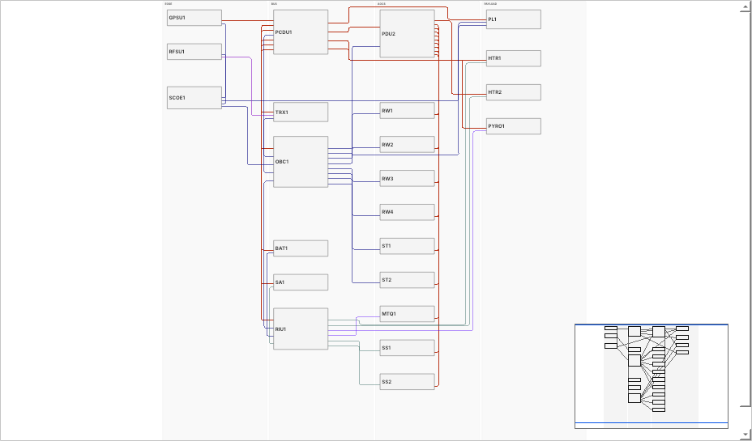

# Harness Design Studio

> **This repository is Harness Design Studio, a tool built on top of [WireViz](https://github.com/wireviz/WireViz).**
> The first part of this README covers Harness Design Studio. The original WireViz README follows unchanged below the divider: [jump to the original WireViz README](#original-wireviz-readme).

[](https://github.com/0h3xn4/WireViz-harnessdesignstudio/actions/workflows/harness-ci.yml)

An offline desktop tool for designing the electrical harnesses of a spacecraft: you draw the units and the connections between them, and the tool works out the connectors, pins and wires, checks them, and writes the drawings and lists.



*The `flatsat` example, one of the five projects that come with the tool.*

## Contents

- [What is this?](#what-is-this)
- [Quick start](#quick-start)
- [Where to go next](#where-to-go-next)
- [Features](#features)
- [Requirements](#requirements)
- [Licence and status](#licence-and-status)
- [What this repository adds to WireViz](#what-this-repository-adds-to-wireviz)
- [Related tools](#related-tools)

## What is this?

A **harness** is the bundle of wires and connectors that joins the boxes (the *units*) of a spacecraft. Designing it by hand means choosing connectors, giving every signal a pin and a wire, and drawing it all again whenever something changes. In Harness Design Studio you describe the units and the *interfaces* (power, data, radio) between them. The tool generates the harnesses, gives a reason for each choice, checks them against design rules, and writes the drawings, wire lists and test tables. It keeps a record of every release.

It works offline and produces byte-identical files for the same design, so the files are friendly to Git. It never invents engineering values: until you supply them, results say *pending* or *not checked*. It is a separate program from WireViz (a different codebase, written from scratch), and it can write each harness as WireViz-style YAML.

## Quick start

You need Ubuntu 24.04 or newer on a 64-bit PC (see [Requirements](#requirements)). These commands install the command line tool in a private Python environment and make a practice project:

```
sudo apt install python3-venv git
git clone https://github.com/0h3xn4/WireViz-harnessdesignstudio.git
cd WireViz-harnessdesignstudio/harness
python3 -m venv .venv && . .venv/bin/activate
pip install ".[gui]"
harness new wheel-link --template first-steps
harness generate wheel-link
harness export wheel-link
```

You should see `Project 'First steps: reaction wheel link' created in wheel-link (3 units, 2 interfaces).`, then `2 added, 0 changed, 0 unchanged, 0 removed, 0 frozen (released); 0 locked pin(s) kept`, then `38 files written to wheel-link/outputs (model 91531b45fd2c).` The drawings and lists are in `wheel-link/outputs/`. To see the diagram, run `harness-gui` and open the project with **File > Open project…**.

The other way to install is a ready-made `.deb` package, which needs no Python knowledge: [`INSTALL.md`](harness/docs/INSTALL.md) has both ways and explains what to do if something fails. The full walk-through with the output of every command is [`GETTING_STARTED.md`](harness/docs/GETTING_STARTED.md).

## Where to go next

Every guide is listed, with one line each, in the [documentation index](docs/README.md).

| You want to | Go to |
| --- | --- |
| **Get started** | [Install](harness/docs/INSTALL.md) · [Getting started](harness/docs/GETTING_STARTED.md) (45 minutes, real output of every command) · [Learning path](harness/docs/LEARNING_PATH.md) (nine steps) · [Concepts](harness/docs/CONCEPTS.md) (ten minutes) |
| **Do a task** | [User manual](harness/docs/user-manual/README.md) (one page per task) · [Tips](harness/docs/TIPS.md) · [Cheat sheet](harness/docs/CHEATSHEET.md) |
| **Look something up** | [User guide](harness/docs/guide/USER_GUIDE.md) (the same text opens in the app with **F1**) · [Command line](harness/docs/CLI.md) · [Design rules](harness/docs/RULES.md) · [Configuration](harness/docs/CONFIG.md) · [Outputs](harness/docs/OUTPUTS.md) · [File format](harness/docs/FILE_FORMAT.md) · [Glossary](harness/docs/GLOSSARY.md) |
| **See examples** | [Examples](harness/docs/examples/README.md) · [The flatsat tour](harness/docs/FLATSAT_EXAMPLE.md) |
| **Bring your data** | [Imports](harness/docs/IMPORTS.md) · [KiCad pinouts](harness/docs/KICAD.md) · [Engineering values and placeholders](harness/docs/PLACEHOLDERS.md) |
| **Fix a problem** | [Troubleshooting](harness/docs/TROUBLESHOOTING.md) · [FAQ](harness/docs/FAQ.md) |
| **See what changed** | [Changelog](harness/CHANGELOG.md) (the root [`CHANGELOG.md`](CHANGELOG.md) explains the two changelogs) |
| **Check the status** | [Status of the tool](harness/README.md#status) · [Compliance records](harness/compliance/README.md) · [Open decisions](harness/docs/OPEN_DECISIONS.md) |
| **Develop or contribute** | [`CONTRIBUTING.md`](CONTRIBUTING.md) · [Developer docs](harness/docs/developer/README.md) · [Architecture](harness/docs/ARCHITECTURE.md) · [Decisions](harness/docs/DECISIONS.md) · [Security](harness/docs/SECURITY.md) · [Release procedure](harness/docs/RELEASE.md) |
| **Use WireViz itself** | The [original WireViz README](#original-wireviz-readme) below, its [syntax description](docs/syntax.md), [tutorial](tutorial/readme.md) and [examples](examples/readme.md) |

## Features

- **Your design is the source of truth.** Harnesses, drawings and lists are generated from it and can be regenerated at any time.
- **Generates the harnesses** — connectors, pins, wires, shields, with a *Why is it like this?* explanation for every choice.
- **Checks them** against 33 design rules and says clearly which checks could not run because a number is missing.
- **Writes the documents** — a wiring-diagram drawing per harness (SVG and PDF), wire lists, pinouts, bill of materials, test tables, labels, a block diagram and a change log.
- **Change control** — review, release and revise a harness; a released harness is locked and every change is recorded.
- **Starts from the usual links** — RS-422, RS-485 and CAN for communication, Micro-D (9 to 31 pins) for power and data, Ethernet for high data rates, SMA for RF. Other types and connectors can be added.
- **Imports** interface tables (CSV or XLSX), approved parts, segment lengths, engineering values and KiCad netlists.
- **Offline and reproducible** — it never uses the network (a test enforces this), and the same design gives byte-identical files.
- **Honest** — it does not invent derating, ampacity, EMC values or approved parts. Until you supply them, results say so.

## Requirements

| | |
| --- | --- |
| System | Ubuntu 24.04 or newer, 64-bit PC (x86-64). Windows, macOS and other Linux systems are not supported. |
| Python | 3.12 or newer, only if you install from source (the `.deb` brings its own). |
| Disk and screen | About 500 MB; a screen of at least 1280 × 720 for the app (the command line needs no screen). |
| Network | None to run it. Installing from source downloads the Python packages once. |

## Licence and status

- **Version `0.1.0`**, released by the repository owner on 2026-10-09 with the engineering decisions still open: the harness boundary rule, the real derating and EMC values, the approved parts list and the title block have not been supplied, so results rest on placeholders and example parts. [`harness/README.md#status`](harness/README.md#status) has the details.
- **Created mainly by an AI.** Harness Design Studio was written mainly by Claude (Anthropic's AI assistant, used through Claude Code); the owner set the requirements and approved the decisions and releases. No other person has reviewed it independently, and it makes no claim of compliance with any standard. Check its results before relying on them. The records are in [`harness/compliance/`](harness/compliance/README.md).
- **Not in the 0.1.0 packages:** some things described in these pages (the `minimal-satellite` and `flatsat` examples, the wiring-diagram drawing with wire colours, *Edit > Wire colours*) are on the `master` branch and not in the 0.1.0 packages. `harness new --list` shows three examples on the packages and five on a build from `master`. The [changelog](harness/CHANGELOG.md) lists what is new.
- **Licence.** The [`LICENSE`](LICENSE) file in this repository is the GPL-3.0 licence of WireViz. The licence of the code in `harness/` has not been decided (decision D-02 in [`harness/docs/DECISIONS.md`](harness/docs/DECISIONS.md); the package metadata says `LicenseRef-Proprietary`). No licence has been granted for it yet.

## What this repository adds to WireViz

| | WireViz (upstream) | This repository |
| --- | --- | --- |
| Program | The `wireviz` Python package in `src/wireviz`, with its `docs/`, `examples/` and `tutorial/` | Unchanged. |
| Second tool | — | **Harness Design Studio** in [`harness/`](harness/README.md): a separate, clean-room codebase (no WireViz code is copied or imported, decision D-01). |
| Where each one's documents are | `docs/`, `tutorial/`, `examples/` | The tool's documents are in [`harness/docs/`](harness/docs/README.md) and `harness/compliance/`. [`docs/README.md`](docs/README.md) is the index of both. |
| README | `docs/README.md` | This file, with the original WireViz README embedded unchanged (except for relative links that had to change) below; an untouched copy is at [`docs/upstream/README.upstream.md`](docs/upstream/README.upstream.md). |
| Continuous integration | WireViz's own workflows | The same, plus [`.github/workflows/harness-ci.yml`](.github/workflows/harness-ci.yml) for the tool. |
| Install | `pip install wireviz` (needs GraphViz) | Separate: see the [quick start](#quick-start). The two do not need each other. |

## Related tools

- **[WireViz](https://github.com/wireviz/WireViz)** draws single cables and harnesses from YAML. Harness Design Studio can export each harness as WireViz-style YAML (best effort, not checked with the WireViz program).
- **[KiCad](https://www.kicad.org/)**: connector pinouts of a unit can be imported from a KiCad netlist ([how](harness/docs/KICAD.md)).
- Moving data between this tool and other engineering tools is described, with what does and does not exist, in [Tips: working with other tools](harness/docs/TIPS.md).

Next: [install it](harness/docs/INSTALL.md), then [getting started](harness/docs/GETTING_STARTED.md).

---

# Original WireViz README

The text below is the README of [wireviz/WireViz](https://github.com/wireviz/WireViz), taken from `docs/README.md` at commit [`e4fe099`](https://github.com/wireviz/WireViz/commit/e4fe099f8c7b86736aee7b4227cc794b6e8b36f0) (2025-01-16, WireViz 0.4.1). It is not reworded. Its headings are one level lower and its relative links point to the right place in this repository. An untouched copy and the steps to refresh it: [`docs/upstream/README.upstream.md`](docs/upstream/README.upstream.md), [`upstream-sync.md`](harness/docs/developer/upstream-sync.md).

<!-- BEGIN UPSTREAM README -->

## WireViz


[](https://pypi.org/project/wireviz/)
[](https://pypi.org/project/wireviz/)
[](https://pypi.org/project/wireviz/)
[](https://github.com/psf/black)

### Summary

WireViz is a tool for easily documenting cables, wiring harnesses and connector pinouts. It takes plain text, YAML-formatted files as input and produces beautiful graphical output (SVG, PNG, ...) thanks to [GraphViz](https://www.graphviz.org/). It handles automatic BOM (Bill of Materials) creation and has a lot of extra features.


### Features

* WireViz input files are fully text based
  * No special editor required
  * Human readable
  * Easy version control
  * YAML syntax
  * UTF-8 input and output files for special character support
* Understands and uses color abbreviations as per [IEC 60757](https://en.wikipedia.org/wiki/Electronic_color_code#Color_band_system) (black=BK, red=RD, ...)
  <!-- * Optionally outputs colors as abbreviation (e.g. 'YE'), full name (e.g. 'yellow') or hex value (e.g. '#ffff00'), with choice of UPPER or lower case (#158) -->
* Auto-generates standard wire color schemes and allows custom ones if needed
  * [DIN 47100](https://en.wikipedia.org/wiki/DIN_47100) (WT/BN/GN/YE/GY/PK/BU/RD/BK/VT/...)
  * [IEC 60757](https://en.wikipedia.org/wiki/Electronic_color_code#Color_band_system)   (BN/RD/OR/YE/GN/BU/VT/GY/WT/BK/...)
  * [25 Pair Color Code](https://en.wikipedia.org/wiki/25-pair_color_code#Color_coding) (BUWH/WHBU/OGWH/WHOG/GNWH/WHGN/BNWH/...)
  * [TIA/EIA 568 A/B](https://en.wikipedia.org/wiki/TIA/EIA-568#Wiring)  (Subset of 25-Pair, used in CAT-5/6/...)
* Understands wire gauge in mm² or AWG
  * Optionally auto-calculates equivalent gauge between mm² and AWG
* Is suitable for both very simple cables, and more complex harnesses.
* Allows for easy-autorouting for 1-to-1 wiring
* Generates BOM (Bill of Materials)

_Note_: WireViz is not designed to represent the complete wiring of a system. Its main aim is to document the construction of individual wires and harnesses.


### Examples

#### Demo 01

[WireViz input file](examples/demo01.yml):

```yaml
connectors:
  X1:
    type: D-Sub
    subtype: female
    pinlabels: [DCD, RX, TX, DTR, GND, DSR, RTS, CTS, RI]
  X2:
    type: Molex KK 254
    subtype: female
    pinlabels: [GND, RX, TX]

cables:
  W1:
    gauge: 0.25 mm2
    length: 0.2
    color_code: DIN
    wirecount: 3
    shield: true

connections:
  -
    - X1: [5,2,3]
    - W1: [1,2,3]
    - X2: [1,3,2]
  -
    - X1: 5
    - W1: s
```

Output file:


[Bill of Materials](examples/demo01.bom.tsv) (auto-generated)

#### Demo 02


[Source](examples/demo02.yml) - [Bill of Materials](examples/demo02.bom.tsv)

#### Syntax, tutorial and example gallery

Read the [syntax description](docs/syntax.md) to learn about WireViz' features and how to use them.

See the [tutorial page](tutorial/readme.md) for sample code, as well as the [example gallery](examples/readme.md) to see more of what WireViz can do.


### Usage

#### Installation

##### Requirements

WireViz requires Python 3.7 or later.

WireWiz requires GraphViz to be installed in order to work. See the [GraphViz download page](https://graphviz.org/download/) for OS-specific instructions.

_Note_: Ubuntu 18.04 LTS users in particular may need to separately install Python 3.7 or above, as that comes with Python 3.6 as the included system Python install.

##### Installing the latest release

The latest WireViz release can be downloaded from [PyPI](https://pypi.org/project/wireviz/) with the following command:
```
pip3 install wireviz
```

##### Installing the development version

Access to the current state of the development branch can be gained by cloning the repo and installing manually:

```
git clone <repo url>
cd <working copy>
git checkout dev
pip3 install -e .
```

If you would like to contribute to this project, make sure you read the [contribution guidelines](docs/CONTRIBUTING.md)!

#### How to run

```
$ wireviz ~/path/to/file/mywire.yml
```

Depending on the options specified, this will output some or all of the following files:

```
mywire.gv         GraphViz output
mywire.svg        Wiring diagram as vector image
mywire.png        Wiring diagram as raster image
mywire.bom.tsv    BOM (bill of materials) as tab-separated text file
mywire.html       HTML page with wiring diagram and BOM embedded
```

Wildcards in the file path are also supported to process multiple files at once, e.g.:
```
$ wireviz ~/path/to/files/*.yml
```

To see how to specify the output formats, as well as additional options, run:

```
$ wireviz --help
```


#### (Re-)Building the example projects

Please see the [documentation](docs/buildscript.md) of the `build_examples.py` script for info on building the demos, examples and tutorial.

### Changelog

See [CHANGELOG.md](docs/CHANGELOG.md)


### Status

This is very much a work in progress. Source code, API, syntax and functionality may change wildly at any time.


### License

[GPL-3.0](LICENSE)

<!-- END UPSTREAM README -->
