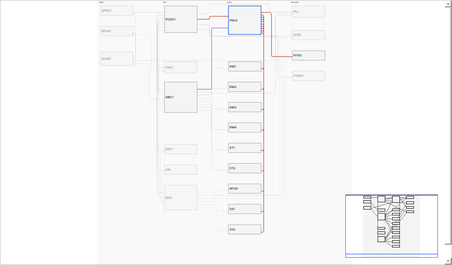

# The flatsat example

A tour of the biggest example that ships with the tool: a **flatsat**. It shows what a real system looks like when every part of the tool is used, and it is a starting point you can copy and change.

A flatsat is the electronics of a spacecraft laid out on a bench, connected with test harnesses, so that the software and the electrical interfaces can be tested before the spacecraft is built. Besides the flight units it contains **ground equipment** that drives them: a checkout system, a power supply and RF test equipment. The example has both.

```
harness new flatsat-bench --template flatsat
```

**This example is on `master` and is not in the released 0.1.0 packages** (see [`CHANGELOG.md`](../CHANGELOG.md#unreleased-after-010)). `harness new --list` shows five examples on a build that has it and three on the 0.1.0 packages; on those, the command above fails with `error: Unknown template 'flatsat'`. The pictures below show the newer diagram.

Open it in the app (**File > Open project...**) or read on first. Everything in this page is what the project really contains; a test checks the numbers.

> **Not engineering data.** The units, parts, currents, lengths and the derating, ampacity and mass numbers are invented for learning. The configuration files stay marked as placeholders and the parts are the tool's example parts (`EX-...`), so the results say so, and a release of this project would need written reasons (`docs/RELEASE.md`). Do not copy the numbers into a real design.

## What it contains

23 units, 44 interfaces, 8 harnesses, 103 wires. It ships **already generated**, with example numbers filled in, so that every output has content from the first minute. The project has four lanes (zones), left to right in the diagram:

| Lane | Units | What it is |
| --- | --- | --- |
| **egse** (ground) | `SCOE1` checkout system, `GPSU1` ground power supply, `RFSU1` RF test equipment | Equipment that never flies. It sends commands and records telemetry, replaces the launch umbilical and closes the RF link by cable. Their subsystem is `egse`. |
| **bus** | `OBC1` on-board computer, `RIU1` remote interface unit, `PCDU1` main power distribution, `BAT1` battery, `SA1` solar array simulator, `TRX1` S-band transceiver | The heart of the spacecraft. |
| **aocs** | `PDU2` AOCS power distribution, `RW1` to `RW4` reaction wheels, `ST1`, `ST2` star trackers, `SS1`, `SS2` sun sensors, `MTQ1` magnetorquer system | Attitude and orbit control. |
| **payload** | `PL1` imager payload, `HTR1`, `HTR2` heater panels, `PYRO1` deployment pyro unit | Payload, thermal control and mechanisms. |

The design is a single string (no redundant chains), as a flatsat usually is. For redundancy see the `small-satellite` example.


That is the whole system at once, and it is busy by nature. Click a unit and only its links stay in colour:



(The pictures are made by `python -m tools.flatsat_screenshots` from the real editor.)

## How the system is wired

- **Power.** The ground supply, the solar array simulator and the battery all feed `PCDU1`. `PCDU1` feeds the computer, the remote interface unit, the transceiver, the payload, the pyro unit and the AOCS distribution unit `PDU2`. `PDU2` feeds the four wheels, the star trackers, the sun sensors and the magnetorquer. Two heater lines (`PCDU1` to `HTR1`, `PDU2` to `HTR2`) have their own type. Every power interface has a maximum current, chosen so that the sums add up: what `PDU2` feeds is what it receives.
- **Data from the computer.** CAN to `PCDU1`, `PDU2`, the four wheels and the remote interface unit; RS-422 to the transceiver and the two star trackers; Ethernet to the payload.
- **Signals through the remote interface unit.** `RIU1` collects the analog sun sensor signals, the discrete drive of the magnetorquer and the pyro unit, the thermistors of the two heater panels and of the solar array, and the battery's CAN monitoring. A real spacecraft does this so that the computer needs fewer connectors; here it is also what makes the example fit the connectors of the starter units.
- **Ground equipment.** `SCOE1` talks to the computer over Ethernet, to the ground power supply and to the payload over RS-422, and to the RF equipment over Ethernet. `TRX1` and `RFSU1` are joined by an RF cable.

## What the tool generated

Eight harnesses, because the example uses the segmentation mode `per_zone_pair` (`config/segmentation.json`): all interfaces between the same two lanes share one harness, like the cable bundle between two panels.

| Harness | Between | Wires | What it carries |
| --- | --- | --- | --- |
| `W001` | aocs and aocs | 18 | `PDU2` to the four wheels, the star trackers, the sun sensors and the magnetorquer: the power of the whole lane |
| `W002` | aocs and bus | 26 | the computer's CAN and RS-422 links to `PDU2`, the wheels and the star trackers; the feed of `PDU2`; the sun sensor and magnetorquer signals from `RIU1` |
| `W003` | aocs and payload | 2 | heater line 2 (`PDU2` to `HTR2`) |
| `W004` | bus and bus | 22 | the battery and the solar array into `PCDU1`; `PCDU1` to the computer, interface unit and transceiver; the data links inside the bus |
| `W005` | bus and egse | 7 | ground power into `PCDU1`, Ethernet between the computer and the checkout system, the RF cable |
| `W006` | bus and payload | 16 | power for the payload, the pyro unit and heater 1; Ethernet to the payload; the pyro and thermistor signals |
| `W007` | egse and egse | 8 | checkout system to power supply and RF equipment |
| `W008` | egse and payload | 4 | the payload test interface |

(The wire counts and what each harness holds are produced by the tool; read any harness in the app with **Why is it like this?** on a wire.)

The totals in `outputs/system/mass_length.csv` after `harness export`: 329.6 m of wire and 2.6 kg with margin. These numbers include the three harnesses that touch the ground equipment (`W005`, `W007`, `W008`); the tool does not know which harnesses fly, so subtract them yourself when you need the flight mass.

## What the design rule check says

`harness drc` reports no errors. It reports warnings and notes, and they are worth reading, because they show what the tool is for:

- **Connector look-alikes.** Many units have several identical connectors (a power distribution unit has eleven identical Micro-D 9 connectors). The rule warns that two cables could be plugged into the wrong place. On a real flatsat you would key the connectors differently or label them.
- **Unapproved parts.** Every part is an example part that nobody has approved, so each is listed. This is the example being honest.
- **Not checked.** Rules that need numbers nobody entered (EMC classes, spare pins, shield grounding) say that they did not run. Silence would look like a pass.

## Things to try

1. **Read the diagram.** With 44 interfaces the whole picture is busy, by nature. Open the project and click `PDU2`: only its links stay in colour and everything else fades. Click the empty background to see everything again, then try `OBC1`, then a single link. Use **Show** in the toolbar to look at power only, then at data only, then at one connector. Select a wire and read **Why is it like this?**
2. **Check the outputs.** `harness export flatsat-bench`, then open `outputs/system/block_diagram.pdf`, `harness_overview.pdf` and a harness drawing in `outputs/harnesses/`. `harness verify flatsat-bench --outputs` re-reads the files independently.
3. **Change a number and watch.** In the app, select the interface *Feed of the AOCS distribution unit* and set its Max current to 8 A, then generate again. The generation reports wire sizing errors that name the wires: no listed gauge carries 8 A after derating. Set it back to 5 A.
4. **Use the spare connectors.** The computer has one free data connector and `PCDU1` has one spare power connector. Add a unit from the *sensor* template, an RS-422 interface from `OBC1` to it and a power interface from `PCDU1` to it, then generate. The new wires appear in the harness between the lanes of the two units. Undo restores everything.
5. **Run out of connectors.** Now add one more unit that needs power and data. The tool tells you that no free connector is left and offers Expert mode, where you add connectors by hand. That is the moment a real design asks for another distribution unit.
6. **Try a different segmentation.** Edit `config/segmentation.json` and set `"mode": "per_unit_pair"`, then regenerate. Compare the number of harnesses. The shipped mode `per_zone_pair` gives 8 harnesses; `per_unit_pair` gives 43; `per_connector_pair` gives one harness for each pair of unit connectors (here 44, one for every interface, because no two interfaces share a pair of connectors). Put the mode back to `per_zone_pair` afterwards.
7. **Practise a release.** Part 9 of [`GETTING_STARTED.md`](GETTING_STARTED.md) shows it on a practice project; this example needs the written reasons for the placeholder configuration and for the unapproved parts. Do it on a copy.

## Where it came from

The project is built by a script (`tools/build_examples.py`, function `_flatsat`) from the tool's own editing functions, so it is valid by construction. The unit list and the interface list are in that script, one row each, if you want to see how it was made or adapt it. The tool version and model hash are in `outputs/system/provenance.json` after an export.

Next: [`LEARNING_PATH.md`](LEARNING_PATH.md) places this example in the whole route; [`CONCEPTS.md`](CONCEPTS.md) explains the words.
