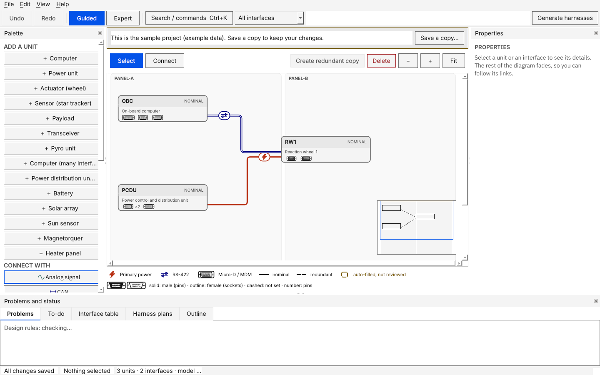
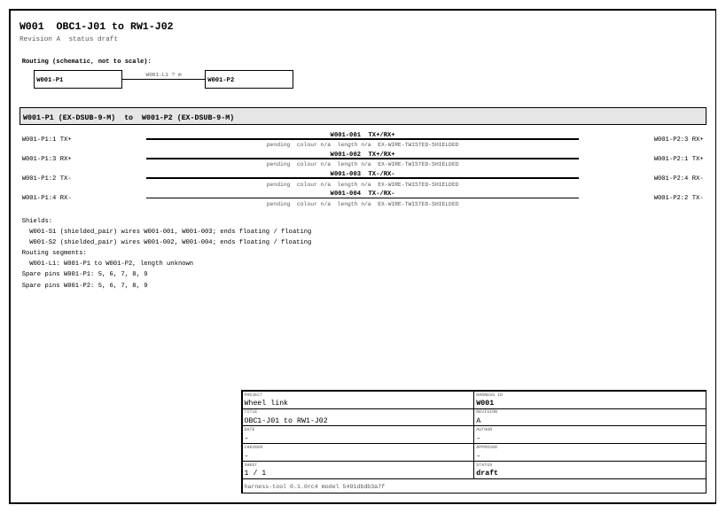
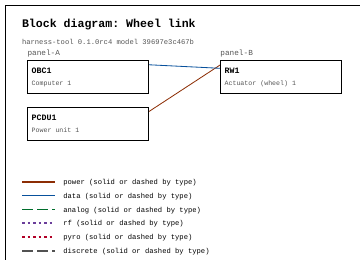

# Getting started: your first harness in 45 minutes

You will start from a small example, look at what the tool makes of it, fix a finding, export the drawings and lists, and (optionally) see what a release looks like. Every step shows what you should see, and what to do if you do not.

**You need:** the tool installed ([`INSTALL.md`](INSTALL.md), five minutes) and nothing else. No spacecraft data, no network.

**Words you do not know?** Read [`CONCEPTS.md`](CONCEPTS.md) first (ten minutes) or look words up as you go.

You can follow the steps in the **app**, on the **command line**, or both. The command line steps give the same results and are easy to paste into a script.

## Part 1: create a practice project

The tool ships three examples. List them:

```
harness new --list
```

```
blank            An empty project: starter parts and interface types, no units.
first-steps      Three units, a power link and an RS-422 link. Nothing is generated yet: start here.
small-satellite  14 units with nominal and redundant chains. Generate it to see a realistic system.
```

Create a practice project from `first-steps`. Pick a folder that does not exist yet:

```
harness new wheel-link --template first-steps --name "Wheel link"
```

```
Project 'Wheel link' created in wheel-link (3 units, 2 interfaces).
Next: harness validate wheel-link   or open it in the app (File > Open project).
```

Check it:

```
harness validate wheel-link
```

```
INFO    placeholder_config: Placeholder rule configuration still in use: derating, emc, generation, segmentation, segregation, titleblock. An engineer must review these before results are trusted.
3 units, 2 interfaces, 8 connectors, 0 harnesses: 0 error(s), 0 warning(s).
```

0 errors is what you want. The INFO line is normal: it says the engineering values are not filled in yet (Part 7).

**In the app:** start **Harness Design Studio**, choose **File > Open project…** and pick the `wheel-link` folder. The app also opens a built-in sample the first time and offers a short tour; **Skip tour** or follow it.

## Part 2: look around



*(The screenshot shows the app's built-in sample, which uses slightly different IDs such as `OBC` and `IF-PWR-RW1`; the layout is the same.)*

| Where | What it is |
| --- | --- |
| Left, **Add a unit** | buttons that add a computer, a power unit, a wheel and so on |
| Left, **Connect with** | the interface types. Pick one, then click two units |
| Middle | the **diagram**: units in lanes (*panel-A*, *panel-B*), links between them. Red is power, blue is data |
| Right, **Properties** | the selected unit or interface: names, **Max current (A)**, notes |
| Bottom tabs | **Problems**, **To-do**, **Interface table**, **Harness plans** |
| Top | **Undo**, **Redo**, **Guided / Expert**, **Search / commands** (Ctrl+K), **Generate harnesses** |

Try this:

1. Click the unit `RW1`. The Properties panel shows it. Click the red link: it is the interface `IF-001`, power from `PCDU1` to `RW1`, with **Max current (A)** 2.
2. Open the **Interface table** tab: every interface in a list (this view also works with a screen reader).
3. Press **Ctrl+Z** after any change to undo it. You cannot break anything here: the example is a practice copy.

## Part 3: generate the harnesses

**In the app:** press **Generate harnesses**. A preview lists what will be added. Read it, then press **Apply**.

**On the command line:**

```
harness generate wheel-link
```

```
2 added, 0 changed, 0 unchanged, 0 removed, 0 frozen (released); 0 locked pin(s) kept
2 interfaces and 6 wires checked: 0 error(s)
```

Two harnesses were made, one for each pair of connectors the interfaces use: `W001` carries the RS-422 link (four wires), `W002` carries power (two wires). Run it a second time and nothing changes: generation is repeatable.

Run the independent check, which shares no code with the generator:

```
harness verify wheel-link
```

```
2 interfaces and 6 wires checked: 0 error(s)
```

## Part 4: read what the tool made

In the app open **Harness plans** and select `W002`:

- The wire list shows the two wires `PWR` and `RTN`.
- The **Why** tab says, for each wire and pin, the rule that decided it. Read a few. This is the tool's answer to "why is it like this?".
- The **Drawing** tab previews the sheet that export will write.

Notice the wire gauge says **pending**. That is deliberate and is the subject of Part 7.

## Part 5: read and answer the Problems

Open the **Problems** tab, or run:

```
harness drc wheel-link
```

```
# Design rule check: Wheel link

Model hash: `4cdebf014ca9`. Rules run: 33.
Open: 0 error(s), 10 warning(s), 8 note(s). Waived: 0.

Placeholder configuration in use: derating, emc, generation, segmentation, segregation, titleblock. Results that depend on it are marked as not checked.
```

You see **0 errors**, 10 warnings and 8 notes. The warnings are all the same kind:

- **`Part EX-MICROD-15-F is not approved yet but is used (2 place(s))`**, and nine more like it (other Micro-D sizes, the Ethernet jack, the two wire parts). The starter library contains *example* parts; none is approved, and only approved parts may be built into flight hardware. Part 8 imports an approved parts list and clears some of them.

A warning can be fixed, or **waived**. **Waive one (app):** in the Problems tab press **Waive…** on one of the part warnings, type a reason of at least 10 characters (for example *Example part, practice project only*) and confirm. The card moves to **Waived** and stays in the report with your reason. Errors cannot be waived.

The **notes** say *not checked*: EMC separation, shield grounding and so on are not checked, **because the engineering values are still placeholders**. A silent pass would be a lie, so the tool says nothing was checked.

The **To-do** tab lists what is left, including *confirm auto-filled connectors*: the connectors on `IF-001` and `IF-002` were chosen by the tool, and a person should confirm them. In the app, select an interface and press **Confirm auto-filled connectors** in Properties.

## Part 6: export drawings and lists

**In the app:** press **Export outputs**. **On the command line:**

```
harness export wheel-link
```

```
38 files written to wheel-link/outputs (model 4cdebf014ca9).
```

The files are checked independently before they are written; if that check fails, nothing is written. Look in `wheel-link/outputs/`:

| File | What it is |
| --- | --- |
| `harnesses/W001/drawing_A3.pdf`, `drawing_A4.pdf`, `drawing_A3_s1.svg` | the harness drawing |
| `harnesses/W001/wirelist.csv` | every wire: signal, interface, connectors, pins, gauge, part, length |
| `harnesses/W001/pinouts.csv` | every connector pin and the wire on it |
| `harnesses/W001/bom.csv`, `mass_length.csv` | parts list; mass and length with what is still unknown |
| `harnesses/W001/tests.csv`, `labels.csv` | continuity and isolation tests; wire labels |
| `harnesses/W001/wireviz.yaml`, `W001.xlsx` | a WireViz-style description; an Excel workbook |
| `system/block_diagram.pdf` | the units and their links |
| `system/harness_overview.pdf`, `box_pinouts.csv`, `mating_matrix.csv`, `traceability.csv` | all harnesses at a glance; the pinout of every unit connector; which cable mates with which unit; which interface is carried by which wires |
| `system/drc_report.md`, `changelog.csv`, `revision_report.md`, `export.json` | the Problems report; the change log; the revision report; the whole model as one JSON |

The harness drawing, with a title block and the model hash (`4cdebf014ca9` is the same fingerprint you saw above):



The block diagram:



Look at the drawing. Wire gauge says `pending`, colour and length say `n/a`. Those are the open questions, and the next two parts answer them.

Can you release this harness yet? Try. A release needs a name and a comment of at least 10 characters:

```
harness release wheel-link W002 --by "A. Engineer" --comment "First release of the wheel power harness"
```

```
blocked: [placeholder_config] These configuration files are still placeholders: derating, emc, generation, segmentation, segregation, titleblock. Have an engineer review the values and set "placeholder" to false in each file (`harness config DIR` lists them). Or release on placeholders with a written reason; the reason is kept in the change log.
blocked: [gauge_pending] 2 wire(s) have no gauge decided (first: W002-001). Fill in the derating values (the file config/derating.json; `harness config DIR` lists what is missing) or set the gauge by hand.
blocked: [length_unknown] 2 wire(s) have no length (first: W002-001). Enter the routing segment lengths (`harness import-lengths DIR FILE` loads them from a table).
```

The tool refuses and says why, in words. Nothing was changed. The first reason (placeholders) waits until Part 9; the next part removes the other two.

## Part 7: fill in values, and see wires get sized

A wire's gauge depends on the current, the derating factors, the length and the allowed voltage drop. The tool cannot know your programme's numbers, so it asks:

```
harness config wheel-link
```

```
Engineering values: 0 of 17 set.
- MISSING config/derating.json ampacity_a_by_awg: current each wire gauge may carry, in amperes, as {"20": 5.0, ...}. Needed for: wire sizing, wire current check.
...
```

For learning, the tool ships **demo values**. They are **not engineering data**; they exist so you can see the machinery work. Copy them over the practice project's configuration, and import the segment lengths from a table:

```
harness templates my-templates
cp my-templates/config-demo-values/*.json wheel-link/config/
harness import-lengths wheel-link my-templates/segment-lengths.csv --unit mm
harness generate wheel-link
harness export wheel-link
```

Now `outputs/harnesses/W002/wirelist.csv` says:

```
W002-001,PWR,IF-001,W002-P1,1,W002-P2,1,22,EX-WIRE-SINGLE,,1,W002-S1,
W002-002,RTN,IF-001,W002-P1,2,W002-P2,2,22,EX-WIRE-SINGLE,,1,W002-S1,
```

Gauge 22 and length 1 m. The **Why** tab now explains it:

```
wire-sizing: ampacity: AWG 22 carries 2.16 A derated (factor 0.72) for 2 A
wire-sizing: voltage drop: AWG 22 gives 0.211345 V over 2 conductor(s), limit 0.5 V
contact-check: not done for PCDU1-J01 (contact rating or derating factor is a placeholder)
```

The smallest gauge in the table that carries 2 A after derating (0.8 for the bundle times 0.9 for temperature), then checked for voltage drop over the imported length. The last line shows the tool still refusing to check what it has no number for. Open `config/derating.json` to see where each number came from. `tests.csv` now carries the test limits from the demo values too.

> **Important.** The files stay marked `"placeholder": true`, so every result built on them still says it rests on placeholders. For a real design your programme's values replace the demo values, and you set `"placeholder": false` only after an engineer reviewed them. Never release a real design with demo values.

The three CSV files in `my-templates/` (`interfaces.csv`, `approved-parts.csv`, `segment-lengths.csv`) are templates: copy one, put your data in, import it. Part 8 does it for parts.

## Part 8: bring in your own data

Every import first shows what it would do. On the command line add `--dry-run` to look without changing anything. Try the approved parts list from the templates, and say what the approval values in it mean (the tool never decides that a part is approved):

```
harness import-parts wheel-link my-templates/approved-parts.csv --approved Approved --pending Review --rejected Rejected --dry-run
harness import-parts wheel-link my-templates/approved-parts.csv --approved Approved --pending Review --rejected Rejected
```

```
Imported 5 part(s).
```

Ask the rules what they think now:

```
harness drc wheel-link
```

```
Open: 1 error(s), 7 warning(s), 3 note(s). Waived: 0.
```

One **error**: *The model changed after the harness plans were generated. Generate again before releasing.* Approving parts changed the design's library, so the plans and outputs are out of date. That is exactly what the check is for. Make the plans and outputs current:

```
harness generate wheel-link
harness export wheel-link
```

```
harness drc wheel-link
```

```
Open: 0 error(s), 7 warning(s), 3 note(s). Waived: 0.
```

0 errors, and 7 warnings: the three parts you approved no longer warn. Other imports work the same way:

| You have | Do |
| --- | --- |
| segment lengths from CAD or a spreadsheet | `harness import-lengths wheel-link my-templates/segment-lengths.csv --unit mm --dry-run` |
| the interfaces as a table | app: **File > Import interfaces…** with `my-templates/interfaces.csv` |
| the connector pinout of a unit in KiCad | `harness import-netlist wheel-link my-templates/wheel-connectors.net --unit RW1 --prefix J --connector J1=RW1-J01 --connector J2=RW1-J02 --dry-run` |

Details and column names: [`IMPORTS.md`](IMPORTS.md), [`KICAD.md`](KICAD.md).

## Part 9 (optional, practice only): release a harness

With the demo values and the lengths of Part 7 the gauge and length reasons of Part 6 are gone, but one is left: the configuration files are still marked `"placeholder": true`. A release is refused until a person has reviewed the values and cleared that mark, or accepts the placeholders with a written reason:

```
harness release wheel-link W002 --by "A. Engineer" --comment "First release of the wheel power harness"
```

```
blocked: [placeholder_config] These configuration files are still placeholders: derating, emc, generation, segmentation, segregation, titleblock. Have an engineer review the values and set "placeholder" to false in each file (`harness config DIR` lists them). Or release on placeholders with a written reason; the reason is kept in the change log.
```

For a real design the engineer reviews the values and sets `"placeholder": false` in each file. For this practice project, accept the placeholders and say why; the reason is kept in the change log and in the baseline:

```
harness release wheel-link W002 --by "A. Engineer" --comment "First release of the wheel power harness" --accept-placeholders "Practice project: demo values only"
```

```
Release W002 revision A: done.
Outputs re-exported with the released status (38 files).
```

`W002` is now **released (locked)**: it, the interfaces it carries and the pins it uses cannot be edited, a baseline and a change log entry are stored, and the drawing says *released*. To change it you start a revision with `harness revise wheel-link W002 --by NAME --comment "..."`; `harness log wheel-link` prints the history, including the reason for releasing on placeholders. In the app the same steps are **Release…**, **New revision…** and **Change log…** in **Harness plans**; the release window asks for the reason when placeholders remain.

Do this only in the practice project. Releasing on placeholders teaches the flow and nothing more: the change log records that the release rested on placeholder values.

## Part 10: build your own from blank

Now do it yourself. Create a blank project and rebuild the wheel link:

```
harness new my-first-design --name "My first design"
```

In the app, **File > Open project…** it, then:

1. Press **+ Power unit**, **+ Computer** and **+ Actuator (wheel)** in the palette. Units appear in the lanes; drag them where you like. Each gets an ID (`PCDU1`, `OBC1`, `RW1`) and some connectors. Rename them in Properties if you want.
2. Under **Connect with** pick **Primary power**, click `PCDU1`, then click `RW1`. Units that cannot take this interface are greyed out, with the reason beside them.
3. Select the new link and set **Max current (A)** to 2. Without a current, a power wire's gauge stays pending.
4. Pick **RS-422**, click `OBC1`, then `RW1`.
5. Look at **Problems** and **To-do**, then **Generate harnesses**, **Apply**, **Export outputs**. **Ctrl+S** saves.

You have now done everything the tool does, once. Add a **Create redundant copy** of the wheel (select it, press the button) and watch the tool build the backup chain and warn when something connects nominal to redundant.

## Where to go next

| You want | Read |
| --- | --- |
| a recipe for one task (import, KiCad, release, Git, CI) | [`HOWTO.md`](HOWTO.md) |
| every command and option | [`CLI.md`](CLI.md) |
| the screen, shortcuts, glossary | the user guide ([`guide/USER_GUIDE.md`](guide/USER_GUIDE.md); **F1** in the app) |
| to try a realistic system | `harness new sat --template small-satellite`, then generate it |
| something went wrong | [`FAQ.md`](FAQ.md) |
| what the examples and templates contain | [`../src/harness_design_studio/resources/examples/templates/README.md`](../src/harness_design_studio/resources/examples/templates/README.md) |
